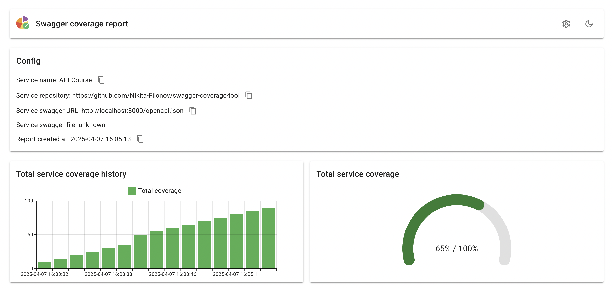
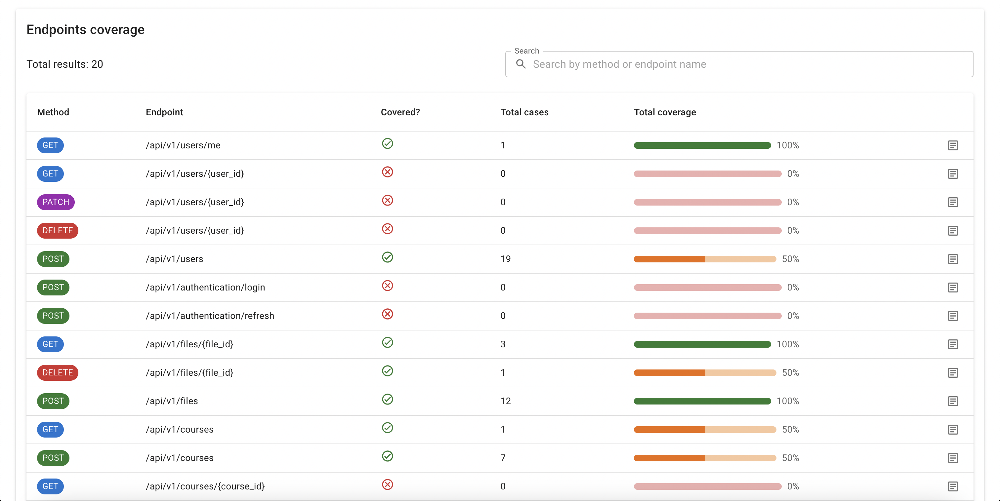
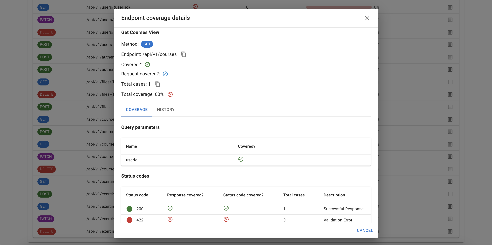

# Swagger Coverage Tool

The Swagger Coverage Tool is designed to measure API test coverage based on Swagger documentation. It provides automated
tracking and reporting of test coverage for APIs, helping ensure that your endpoints and services are well-tested.

## Features

- *Automatic Coverage Measurement:* The tool automatically measures coverage, generating a report based on the collected
  data.
- *Multiple Swagger Documentations:* It supports working with multiple Swagger documentation files. For example, if you
  have multiple microservices with their own Swagger documentation, the coverage can be measured separately for each
  service.
- *Overall Service Coverage:* It calculates the total coverage of each service.
- *Endpoint Coverage:* Measures whether each endpoint is covered by tests and to what percentage. It also counts the
  number of test cases that cover a given endpoint.
- *Status Code Coverage:* Tracks which status codes were covered, including the number of test cases that cover each
  status code.
- *History of Coverage:* Maintains a history of coverage for each service and endpoint.
- *Flexible Searching and Sorting:* Supports flexible data search and sorting, making it easy to analyze coverage
  results.
- *HTML Report Generation:* All coverage data is aggregated into a single index.html report file, which can be opened,
  shared, or published.
- Support for [httpx](https://www.python-httpx.org/) and [requests](https://requests.readthedocs.io/en/latest/)
  Libraries: The tool works with both httpx and requests libraries for making HTTP requests.

You can see a report example [here](https://nikita-filonov.github.io/swagger-coverage-tool/).

If you have any questions, you can ask [@Nikita Filonov](https://t.me/sound_right)

## Preview

### Summary



### Endpoints



### Details



## Installation

```shell
pip install swagger_coverage_tool
```

## Usage

### Simple Example with `httpx`

Here's an example of how to use the tool with [httpx](https://www.python-httpx.org/):

```python
import httpx

from swagger_coverage_tool import get_settings, SwaggerCoverageTracker

# Initialize the tracker with service and settings
tracker = SwaggerCoverageTracker(
    service="api-service",  # Name of the service
    settings=get_settings()  # Load settings
)


# Track coverage for the "get_user" endpoint
@tracker.track_coverage_httpx("/api/v1/users/{user_id}")
def get_user(user_id: str):
    return httpx.get(f"http://localhost:8000/api/v1/users/{user_id}")


# Track coverage for the "create_user" endpoint
@tracker.track_coverage_httpx("/api/v1/users")
def create_user():
    return httpx.post("http://localhost:8000/api/v1/users")


# Make requests
get_user("123")
create_user()


```

After executing the HTTP requests, coverage data will be automatically collected and saved to the `coverage-results`
folder by default.

### Simple Example with `requests`

Here's the same example using the [requests](https://requests.readthedocs.io/en/latest/) library:

```python
import requests

from swagger_coverage_tool import get_settings, SwaggerCoverageTracker

tracker = SwaggerCoverageTracker(
    service="api-service",
    settings=get_settings()
)


@tracker.track_coverage_httpx("/api/v1/users/{user_id}")
def get_user(user_id: str) -> requests.Response:
    return requests.get(f"http://localhost:8000/api/v1/users/{user_id}")


@tracker.track_coverage_httpx("/api/v1/users")
def create_user() -> requests.Response:
    return requests.post("http://localhost:8000/api/v1/users")


get_user()
create_user()

```

### Coverage Report Generation

Once the requests have been executed, coverage data will be collected into the `coverage-results` folder by default. You
can generate a detailed coverage report by running the following command:

```shell
swagger-coverage-tool save-report
```

This will generate a coverage report based on the collected data. The report will be saved as an HTML file (index.html)
that you can view or share.

## Configuration

You can configure the Swagger Coverage Tool using a single file: either a YAML, JSON, or `.env` file. By default, the
tool looks for configuration in:

- `swagger_coverage_config.yaml`
- `swagger_coverage_config.json`
- `.env` (for environment variable configuration)

All paths are relative to the current working directory, and configuration is automatically loaded via `get_settings()`.

### Configuration via `.env`

All settings can be declared using environment variables. Nested fields use dot notation, and all variables must be
prefixed with `SWAGGER_COVERAGE_`.

*Example:* [.env](docs/configs/.env.example)

```dotenv
SWAGGER_COVERAGE_SERVICES='[
    {
        key": "my-api-service",
        "name": "My API Service",
        "tags": ["API", "PRODUCTION"],
        "repository": "https://github.com/my-api",
        "swagger_url": "https://my-api.com/swagger.json"
    }
]'

# The directory where the coverage results will be saved.
SWAGGER_COVERAGE_RESULTS_DIR="./coverage-results"

# The file that stores the history of coverage results.
SWAGGER_COVERAGE_HISTORY_FILE="./coverage-history.json"

# The retention limit for the coverage history. It controls how many historical results to keep.
SWAGGER_COVERAGE_HISTORY_RETENTION_LIMIT=30

# Optional file paths for the HTML and JSON reports.
SWAGGER_COVERAGE_HTML_REPORT_FILE="./index.html"
SWAGGER_COVERAGE_JSON_REPORT_FILE="./coverage-report.json"
```

*Note:* Either `swagger_url` or `swagger_file` is required for each service.

### Configuration via YAML

*Example:* [swagger_coverage_config.yaml](docs/configs/swagger_coverage_config.yaml)

```yaml
services:
  - key: "my-api-service"
    name: "My API Service"
    tags: [ "API", "PRODUCTION" ]
    repository: "https://github.com/my-api"
    swagger_url: "https://my-api.com/swagger.json"
    # swagger_file: "swagger_file_path.json"  # Optional if not using swagger_url

results_dir: "./coverage-results"
history_file: "./coverage-history.json"
history_retention_limit: 30
html_report_file: "./index.html"
json_report_file: "./coverage-report.json"
```

### Configuration via JSON

*Example:* [swagger_coverage_config.json](docs/configs/swagger_coverage_config.json)

```json
{
  "services": [
    {
      "key": "my-api-service",
      "name": "My API Service",
      "tags": [
        "API",
        "PRODUCTION"
      ],
      "repository": "https://github.com/my-api",
      "swagger_url": "https://my-api.com/swagger.json"
    }
  ],
  "results_dir": "./coverage-results",
  "history_file": "./coverage-history.json",
  "history_retention_limit": 30,
  "html_report_file": "./index.html",
  "json_report_file": "./coverage-report.json"
}
```

### Configuration Reference

| Key                       | Description                                                                                       | Required | Default                   |
|---------------------------|---------------------------------------------------------------------------------------------------|----------|---------------------------|
| `services`                | List of services to track. Each must define `key`, `name`, and a `swagger_url` or `swagger_file`. | ✅        | —                         |
| `services[].key`          | Unique internal identifier for the service.                                                       | ✅        | —                         |
| `services[].name`         | Human-friendly name for the service (used in reports).                                            | ✅        | —                         |
| `services[].swagger_url`  | URL to Swagger (OpenAPI) schema.                                                                  | ❗        | —                         |
| `services[].swagger_file` | Local file path to Swagger schema (alternative to URL).                                           | ❗        | —                         |
| `services[].tags`         | Optional tags used in reports for filtering or grouping.                                          | ❌        | —                         |
| `services[].repository`   | Optional repository URL (will be shown in report).                                                | ❌        | —                         |
| `results_dir`             | Directory to store raw coverage result files.                                                     | ❌        | `./coverage-results`      |
| `history_file`            | File to store historical coverage data.                                                           | ❌        | `./coverage-history.json` |
| `history_retention_limit` | Maximum number of historical entries to keep.                                                     | ❌        | `30`                      |
| `html_report_file`        | Path to save the final HTML report (if enabled).                                                  | ❌        | `./index.html`            |
| `json_report_file`        | Path to save the raw JSON report (if enabled).                                                    | ❌        | `./coverage-report.json`  |

### How It Works

Once configured, the tool automatically:

- Loads all Swagger definitions from the given URLs or files.
- Tracks test coverage during API calls.
- Writes raw coverage data to `coverage-results/`.
- Stores optional historical data and generates an HTML report at the end.

No manual data manipulation is required – the tool handles everything automatically based on your config.

## Command-Line Interface (CLI)

The Swagger Coverage Tool provides several CLI commands to help with managing and generating coverage reports.

### Command: `save-report`

Generates a detailed coverage report based on the collected result files. This command will process all the raw coverage
data stored in the `coverage-results` directory and generate an HTML report.

*Usage:*

```shell
swagger-coverage-tool save-report
```

- This is the main command to generate a coverage report. After executing API tests and collecting coverage data, use
  this command to aggregate the results into a final report.
- The report is saved as an HTML file, typically named index.html, which can be opened in any browser.

### Command: `copy-report`

This is an internal command mainly used during local development. It updates the report template for the generated
coverage reports. It is typically used to ensure that the latest report template is available when you generate new
reports.

*Usage:*

```shell
swagger-coverage-tool copy-report
```

- This command updates the internal template used by the save-report command. It's useful if the template structure or
  styling has changed and you need the latest version for your reports.
- This command is typically only used by developers working on the tool itself.

### Command: `print-config`

Prints the resolved configuration to the console. This can be useful for debugging or verifying that the configuration
file has been loaded and parsed correctly.

*Usage:*

```shell
swagger-coverage-tool print-config
```

- This command reads the configuration file (`swagger_coverage_config.yaml`, `swagger_coverage_config.json`, or `.env`)
  and prints the final configuration values to the console.
- It helps verify that the correct settings are being applied and is particularly useful if something is not working as
  expected.